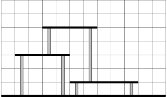
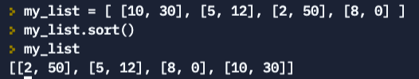

Object-Oriented Programming  
Spring 2022  
Class 25 - ADVANCED


# Getting Help 

* Card game [video lecture](https://watch.screencastify.com/v/NOv0RiOkecfsr0GaZCc1) and [demo code](https://replit.com/@mcarlberg/HW25DemoCardGame) 

* Class 25 [presentation on functions](https://docs.google.com/presentation/d/17avL29-WAWEG8Rb8UUhuWnyI4Kbavhvmx1xfxUhH0YY/edit?usp=sharing)

* HW 24 Functions Practice [Solutions](https://replit.com/@mcarlberg/HW24-FunctionsPractice-SOLUTIONS#main.py)

* W3Schools tutorial on [functions](https://www.w3schools.com/python/python_functions.asp)
   
* Relevant [flash cards](https://drive.google.com/file/d/1Pbpyg1eRtImUo-kD8Pbx9Y5JPk1WavrA/view?usp=sharing)

* Extended [reading](https://drive.google.com/file/d/1PVRf7MvHokHhCdiz7o4ey2tsB_nZSbgv/view?usp=sharing)

* All [Getting Help material](https://github.com/mattcarlberg/OOP-Sp22-Reference) from previous classes


# Challenge

Platforms need your support!   

For example, these three platforms:

need these supports


The goal is to calculate the total amount of vertical platform units needed. (The example above requires 14 vertical units of platform.)


For this problem, we will use a standard coordinate system with (0, 0) in the bottom left, the y-axis pointing up and the x-axis pointing right.  The ground is described by the the line `y=0`. 

# Input 

The first line contains an integer `N` , the number of platforms. Each of the following  lines contains information about a single platform.  

Each platform is described by three integers:
* The first number is the altitude `Y`, i.e. the y-coordinate of the platform.  It is guaranteed that `Y > 0`.
* The  second number is the left edge of the platform `X1`.  In other words, the left endpoint of the platform is given by `(X1,Y)`.
* The third number is the right edge of the platform `X2`.  In other words, the right endpoint of the platform is given by `(X2,Y)`.  It is guaranteed that `X2 > X1` and `X2 < 100`.   


The input will be such that no two platforms overlap.

# Output

Each platform needs vertical supports on both sides, 0.5 units in from its edge.  

Output the total number of vertical units needed to support all the platforms.    


# Required Function

You are allowed to make as many functions as you like to solve this problem, but you are REQUIRED to define and use the following function:

```
Function name: contains()

Description:
    Checks if a particular x-coordinate is contained with the x-coordinates of a patform.

    Parameters
    ----------
    x : float
        x-coordinate being checked
    platform : [int, int, int]
        Platform being checked

    Returns
    -------
    bool
        True if x is contained inside the x-coordinates of the platform 

    Examples
    --------
    contains(20.0, [100, 5, 10]) --> False
    contains(7.3, [100, 5, 10]) --> True

```


# Example Input #1

The picture example above is represented by this input:
```
3
1 5 10
3 1 5
5 3 7
```
for which the output is `14`. 

# Example Input #2

The input:
```
5
50 50 90
40 40 80
30 30 70
20 20 60
10 10 50
```
should output `200`. 

# TIPS

* For a platform `P` and one of its ends, imagine extending a vertical support downwards. Of all platforms below `P`, the vertical support will end on the highest platform whose x coordinates contain the x coordinate of the vertical support.  The height of the vertical support is the difference of the y-coordinates.

* When you use Python's `list.sort()` method on a list of lists.  It has a useful behavior:  It sorts the lists in ascending order **based on the first item** in each list. For example:
